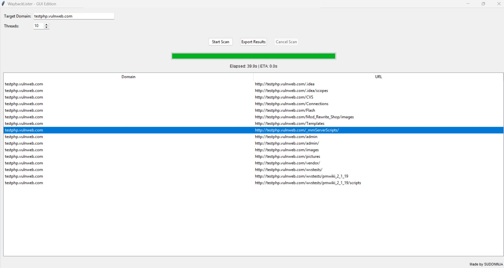

# Directory Listings Checker GUI 

A simple Python GUI tool that uses the Wayback Machine to detect exposed directory listings on historical URLs from a given domain.
This can be useful for recon or security research, especially in bug bounty and pentesting contexts.

---

## 🚀 Features

- GUI powered by `tkinter`
- Scans for directory listing pages via Wayback URLs
- Auto-extracts paths and tests for exposure
- Multi-threaded scanning for speed
- Progress bar with estimated time remaining (ETA)
- Cancel scan at any time
- Export results to **Excel** and **HTML**
- Made by **SUDONINJA** ✌️

---

## 📦 Requirements

Python 3.8+

Install all dependencies:
```bash
pip install -r requirements.txt
```

---

## 📂 How to Use

1. Clone this repo:
```bash
git clone https://github.com/sudoninja-noob/Router-Testing-Tool.git
cd directory-listings-checker
python Directory_Listings _Checker.py
```

2. Install dependencies:
```bash
pip install -r requirements.txt
```

3. Run the GUI:
```bash
python your_script_name.py
```

---

## 📁 Exported Results
- `directory_listings.xlsx`: Spreadsheet of results
- `directory_listings.html`: Web view of results

---

## 💻 Screenshot


---

## 🛡️ Disclaimer
This tool is for educational and authorized security testing purposes only. Use responsibly.

---

## ✍️ Author
Made by **SUDONINJA**

